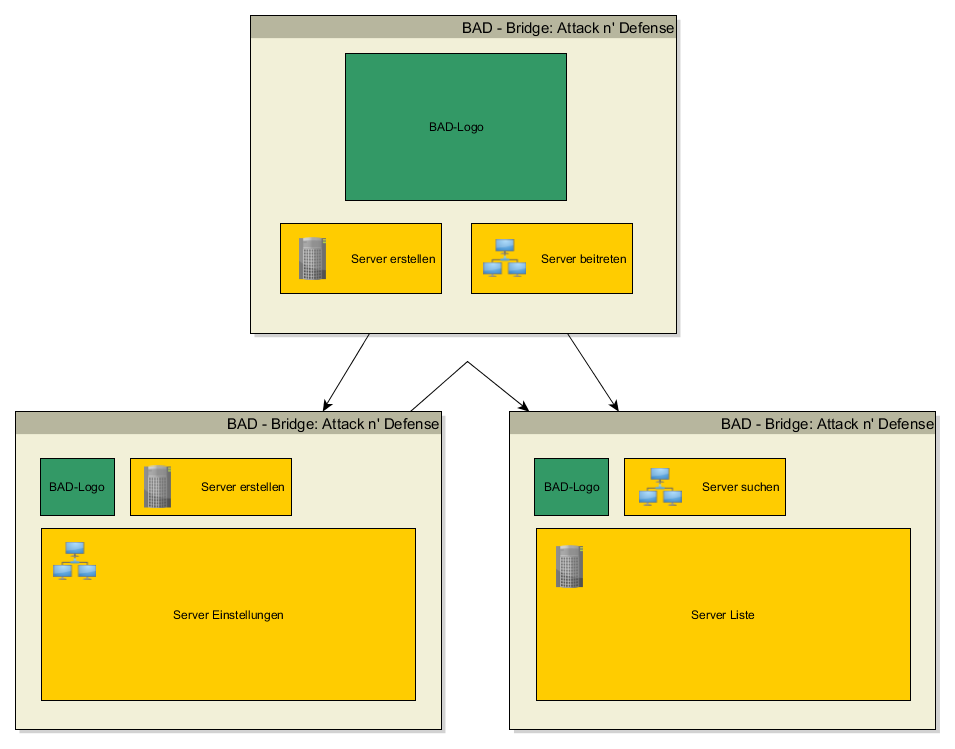
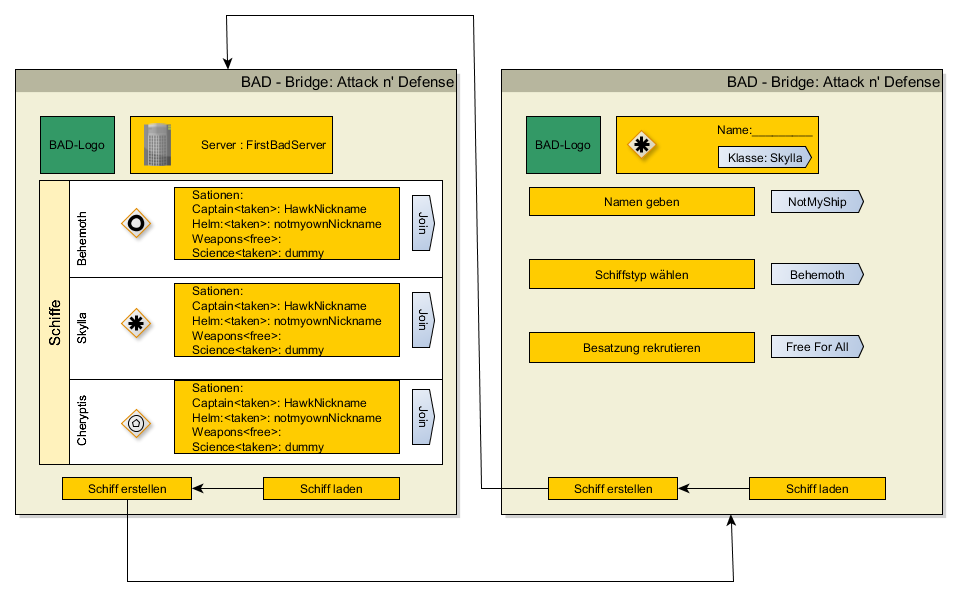

##Server-Auswahl  
1. Ich als Spieler starte den client und sehe eine Liste aller verfügbaren Server
2. Ich als Spieler starte den Client und darüber einen neuen Server  
3. Ich als Spieler starte den Client wähle einen Server aus und verbinde ich mit diesem über einen Button  
4. Ich als Serverersteller konfiguriere die Art des Spiels  
  

  
##Schiff  
1. Ich als Spieler bin auf einem Server und sehe eine Liste aller verfügbaren Schiffe  
2. Ich als Spieler bin auf einem Server und erstelle ein neues Schiff. Dazu gebe ich einen Schiffs-Typ und einen Namen an.  
  1. Das Schiff ist Free-For-All, wobei die Rollen nach First-come-First-serve verteilt werden  
  2. Das Schiff ist Free-For-Asign, wobei sich jeder auf das Schiff verbinden kann aber, der "Besitzer" des Schiffes bestimmt, wer welche Rolle bekommt.  
  3. Das Schiff ist Restricted-For-All, wobei der Zugriff auf das Schiff mit einem Passwort geschützt ist, danach kann jede Rolle gewählt werden  
  4.  Das Schiff ist Restricted-For-Asign, wobei der Zugriff auf das Schiff mit einem Passwort geschützt ist, danach bestimmt der "Besitzer" des Schiffes, wer welche Rolle bekommt.  
3. Ich als Spieler bin auf einem Server und lade ein bestehendes Schiff aus einem Spielstand  
4. Ich als Spieler bin auf einem Server und wähle ein Schiff aus.
5. Ich als Spieler wähle mich in einen Server ein und wähle ein existierendes Schiff aus
	1. Ich als Spieler kann nun meine Wunschrolle(n) angeben, der Spieleinhaber kann nun entscheiden welche Rolle ich bekomme
6. Ich als Captain bin der Ersteller eines Schiffs auf dem Server

  

  
##Lobby eines Schiffes das noch nicht gestartet ist  
1. Ich als Spieler bin in der Lobby eines Schiffes und sehe alle verbundenen Besatzungsmitglieder und verfügbaren Tasks/Rolle  
2. Ich als Spieler bin in der Lobby und wähle ein Set von Tasks/ eine Rolle wenn es möglich ist  
3. Ich als Besitzer des Schiffes weise die Besatzungsmitgliedern ihre Tasks / Rollen zu  
4. Ich als Captain sehe alle Spieler, die mein Schiff ausgewählt haben
5. Ich als Captain sehe alle Wunschrollen und kann den Spielern die Rollen zuweisen / bestätigen
6. Ich als Captain starte das Schiff.  
  
##Lobby eines Schiffes das bereits gestartet ist  
1. Ich als Spieler bin in der Lobby eines Schiffes und sehe alle verbundenen Besatzungsmitglieder und verfügbaren Rollen. Der Besitzer des Schiffes wird per InGame-Message informiert.  
⋅⋅* der Besitzer bestätigt das neue Mitglied  
	
##Starten des Spiels  
1.) Ich als Besatzungsmitglied sehe einen BAD-Desktop mit Fenstern für meine Aufgaben 
